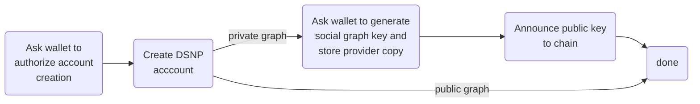
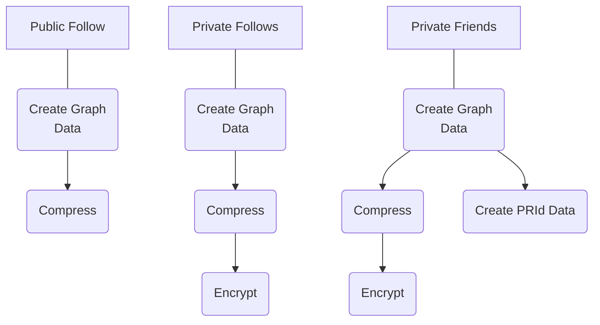
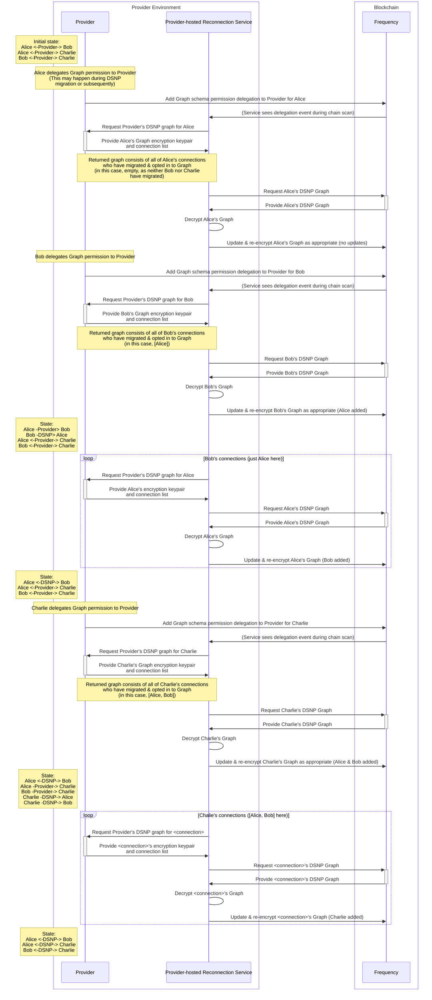
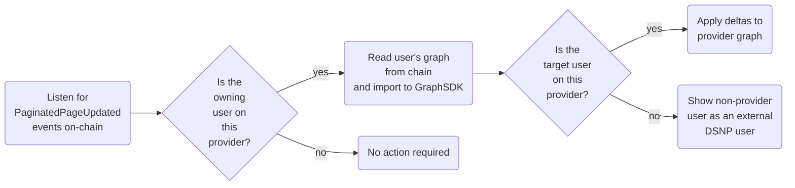

# Graph Reconnection Service
A microservice to reconnect graphs in DSNP/Frequency

## Overview/Design
The Graph Reconnection Service is designed to be hosted by a Provider inside their own environment. The service will scan the Frequency chain for new delegations to the Provider delegating Graph schema permissions for a user. The service then requests the user's Provider Graph and keys from the Provider, and updates the user's graph on-chain.

The following diagrams are intended as a guide for providers to understand how to work with DSNP's social graph.

For user relationships to be stored in a DSNP social graph, the users on both ends of the relationship must have DSNP accounts and have granted graph permission to the provider.

## Installation and Deployment

For instructions on downloading and installing/deploying the application, see [here](./INSTALLING.md)

## Provider Flow

This flow must be implemented between the Provider and a Wallet. It is outside the purview of the Graph Reconnection Service, but must be completed for a user before that user's graph can be migrated.

## Reconnection Service

### Graph Update Flow to Blockchain
The following diagram illustrates the differences in what is required to update a user's graph on-chain for different types of graphs: Public vs. Private, and Follow vs. Friendship. As shown, Private graph updates require the user's graph encryption keys, as Private graph data is stored encrypted on-chain. An additional requirement for Private Friendship also requires the counterparty's public graph encryption key. This enables the construction of a shared secret, a PRId, which is used to securely represent the connection in a public way. (The PRId is stored publicly on-chain, but the other side of the connection cannot be derived from it.)

### Sequence Diagram
The following sequence diagram illustrates an example event flow where three users (Alice, Bob, and Charlie), who are all mutually friends, onboard to DSNP at different times & have their social graphs migrated to DSNP in stages.

## Other Graph Scenarios
### Handling External DSNP User Data Changes
Though outside the responsibility of the Graph Reconnection Service, it's relevant to understand how a provider application might incorporate changes made by other actors on the blockchain into their own platform.

When a user's graph is modified (whether by themselves or another provider to whom permission has been delegated), a page updated event is published on the blockchain. By correlating the schema ID contained in this event with the known schema IDs for the social graph, a provider can determine whether a user's graph has been updated, and synchronize the authoritative blockchain version of the graph with their own internal representation.

