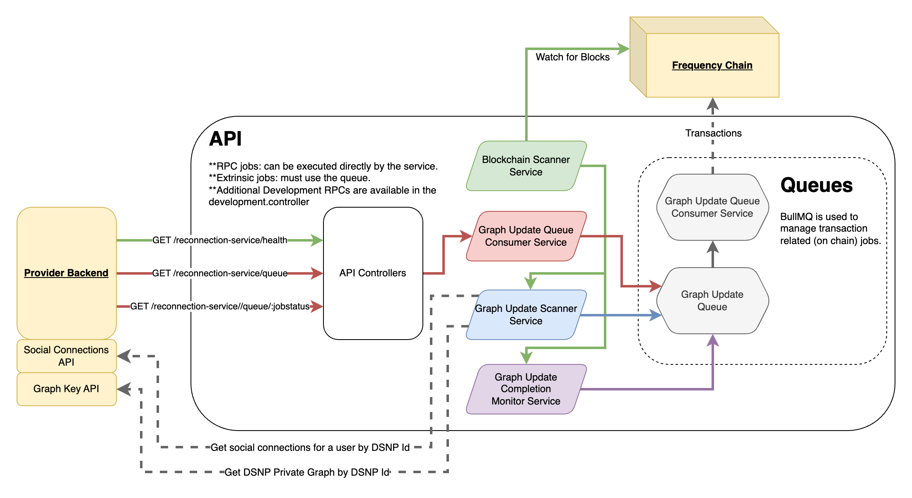

# Graph Reconnection Service

<!-- TABLE OF CONTENTS -->

# 📗 Table of Contents

- [📖 About the Project](#about-project)
- [🔍 Arch Map](#-arch-maps)
- [🛠 Built With](#-built-with)
  - [Tech Stack](#tech-stack)
  - [Key Features](#key-features)
- [🚀 Live OpenAPI Docs](#-live-docs)
- [💻 Getting Started](#-getting-started)
  - [Prerequisites](#prerequisites)
  - [Setup](#setup)
  - [Install](#install)
  - [Usage](#usage)
  - [Run tests](#run-tests)
  - [Deployment](#deployment)
- [🤝 Contributing](#-contributing)
- [⭐️ Show your support](#-support)
- [🙏 Acknowledgements](#-acknowledgements)
- [❓FAQ](#faq)
- [📝 License](#-license)

<!-- PROJECT DESCRIPTION -->

# 📖 [project_name] <a name="about-project"></a>

> Describe your project in 2 paragraphs.

Reconnection Service provides a way for Providers who are _migrating_ their userbase to DSNP/Frequency to easily handle the graph updates as users opt into the migration.

The service scans the Frequency chain for new delegations for the Provider. It then requests, via a Provider's API, the user's Graph keys and the Provider's graph and proceeds to update the migrated user's graph **and** the graph of previously migrated users connected to the newly migrated user.

<!-- Mermaid Arch maps -->

## 🔭 Arch Maps

The Reconnection Service has one main loop that watches the chain for new blocks. Those blocks are then processed to look for new delegations and completed jobs.



### Additional Diagrams

- [Example Sequence Diagram](./docs/example-sequence-diagram.md)
- [Internal Service Graph Update Flows](./docs/internal-graph-update-flow.md)


<p align="right">(<a href="#-table-of-contents">back to top</a>)</p>

## 🛠 Built With <a name="built-with"></a>

### Tech Stack <a name="tech-stack"></a>

<details>
  <summary>Framework</summary>
  <ul>
    <li><a href="https://nestjs.com/">NestJS</a></li>
  </ul>
</details>

<details>
  <summary>Language</summary>
  <ul>
    <li><a href="https://www.typescriptlang.org/">Typescript</a></li>
  </ul>
</details>

<details>
  <summary>Testing Libraries</summary>
  <ul>
    <li><a href="https://jestjs.io/">Jest</a></li>
  </ul>
</details>

<details>
  <summary>Linting</summary>
  <ul>
    <li><a href="https://eslint.org/">ESLint</a></li>
    <li><a href="https://prettier.io/">Prettier</a></li>
  </ul>
</details>

<details>
  <summary>Data Store</summary>
  <ul>
    <li><a href="https://github.com/luin/ioredis">ioredis</a></li>
  </ul>
</details>

<details>
  <summary>Request Library</summary>
  <ul>
    <li><a href="https://axios-http.com/">Axios</a></li>
  </ul>
</details>

<details>
  <summary>Scheduling</summary>
  <ul>
    <li><a href="https://docs.nestjs.com/techniques/task-scheduling">NestJS Schedule</a></li>
  </ul>
</details>

<details>
  <summary>Validation</summary>
  <ul>
    <li><a href="https://github.com/typestack/class-validator">class-validator</a></li>
    <li><a href="https://joi.dev/">Joi</a></li>
  </ul>
</details>

<details>
  <summary>Environment Configuration</summary>
  <ul>
    <li><a href="https://github.com/motdotla/dotenv">dotenv</a></li>
  </ul>
</details>

<details>
  <summary>Containerization</summary>
  <ul>
    <li><a href="https://www.docker.com/">Docker</a></li>
    <li><a href="https://docs.docker.com/compose/">Docker Compose</a></li>
  </ul>
</details>

<details>
  <summary>API Documentation</summary>
  <ul>
    <li><a href="https://swagger.io/">Swagger</a></li>
  </ul>
</details>

<!-- Features -->

### Key Features

- **Supports Opt-in DSNP/Frequency Migration**
- **Updates Newly Migrated User Graph**
- **Updates Graphs of Connections**

<p align="right">(<a href="#-table-of-contents">back to top</a>)</p>

<!-- LIVE Docs -->

## 🚀 Live Docs

- [Live Docs](https://amplicalabs.github.io/reconnection-service)

<p align="right">(<a href="#-table-of-contents">back to top</a>)</p>

<!-- GETTING STARTED -->

## 💻 Getting Started

To get a local copy up and running, follow these steps.

### Prerequisites

In order to run this project you need:

- [Node.js](https://nodejs.org)
- [Docker](https://docs.docker.com/get-docker/)

### Setup

Clone this repository to your desired folder:

Example commands:

```sh
  git clone git@github.com:AmplicaLabs/account-service.git
  cd account-service
```

### Environment Variables

Modify any environment variables in the `.env` file as needed. For docker compose env `.env.docker.dev` file is used. The complete set of environment variables is documented [here](./ENVIRONMENT.md), and a sample environment file is provided [here](./env.template).

1. Copy the template values into the .env files.
   ```sh
   cp env.template .env
   cp env.template .env.docker.dev
   ```
2. Replace template values with values appropriate to your environment.

### Install

Install NPM Dependencies:

```sh
  npm install
```

### Usage

Note: using [docker compose file](docker-compose.yaml) to start the services. This will start the services in development mode.

In order to run the `account-service` in development mode without containers, you can use the following commands:

#### 1. Start the Redis server container, the Frequency container, and the mock webhook server. You can view the logs with your Docker setup.

   ```bash
   docker compose up -d redis frequency webhook
   ```

#### 2. Once [Frequency](https://polkadot.js.org/apps/?rpc=ws%3A%2F%2F127.0.0.1%3A9944#/explorer) is up, run the chain setup. This will setup 7000 MSAs on the chain with Graph.

   ```bash
   npm run chain-setup
   ```

#### 3. Start the Api.<br /><br />

   **Option 1:** In a new terminal window, start the `reconnection-service` app. Logs will be displayed in the terminal for easy reference.

   ```sh
   npm run start:api:debug
   ```

   -- or -- <br /><br />

   **Option 2:**
   Run the following command to start the account service api and worker containers. This will start the account service api and worker in development mode.

   ```sh
   docker compose up -d reconnection-service
   ```

#### 4. Check the job in [BullUI](http://0.0.0.0:3000/reconnection-service/queue/), to monitor job progress based on defined tests.

## 📋 Testing

### Run the tests.

   ```bash
   npm run test
   ```

   This will run the matching `*.spec.ts` files.

#### Check e2e test file for more details on the test.

### Queue Management

You may also view and manage the application's queue at [http://localhost:3000/reconnection-service/queue](http://localhost:3000/reconnection-service/queue).

### Linting

```sh
  npm run lint
```

### Auto-format

```sh
  npm run format
```

### Debugging

- Docker to stop containers, networks, volumes, and images created by `docker compose up` run...
  ```sh
    docker compose down
  ```
- You may have to go to your Docker Desktop app and manually remove containers.

### Using the Debugger with VSCode

1. Follow step 1 from the Development Environment section above to set up the redis and frequency containers.

2. Use the debug panel and start the `Debug Api (NestJS via ts-node)` configuration, if you wish to debug the api.

3. Set breakpoints in the code and debug your code.

4. Monitor the service worker jobs in [BullUI](http://0.0.0.0:3000/reconnection-service/queue/).

   Any API functions that require an extrinsic to be submitted to the blockchain will be queued here. The queue will manage the amount of `capacity` this service is allowed to use.

   Reference the [Frequency Docs](https://docs.frequency.xyz/) for more information about extrinsics and capacity.

**Note:** Reference `.vscode/launch.json` for more details on the debug configurations and apply the concepts to your preferred debugger.

<p align="right">(<a href="#-table-of-contents">back to top</a>)</p>

<!-- CONTRIBUTING -->

## 🤝 Contributing

Contributions, issues, and feature requests are welcome!

- [Contributing Guidelines](https://github.com/AmplicaLabs/gateway/blob/main/CONTRIBUTING.md)
- [Open Issues](https://github.com/AmplicaLabs/reconnection-service/issues)

<p align="right">(<a href="#-table-of-contents">back to top</a>)</p>

<!-- SUPPORT -->

## ⭐️ Show your support

If you would like to explore contributing bug fixes or enhancements, issues with the label `good-first-issue` can be a good place to start.

<p align="right">(<a href="#-table-of-contents">back to top</a>)</p>

<!-- FAQ (optional) -->

## ❓FAQ

- **Do I need this?**

  - Only if you have non-DSNP/Frequency users with existing graph connections that should be recreated on migration.

- **Does it need to run all the time?**

  - No. If the connected node is an archive node, then it can replay the blocks as needed.

- **What if something else already updated the graph?**

  - The Reconnection Service will check and only add the needed connections. If all the connections already exist, then the service will do nothing on chain and continue.

<p align="right">(<a href="#-table-of-contents">back to top</a>)</p>

<!-- LICENSE -->

## 📝 License

This project is [Apache 2.0](./LICENSE) licensed.

<p align="right">(<a href="#-table-of-contents">back to top</a>)</p>
