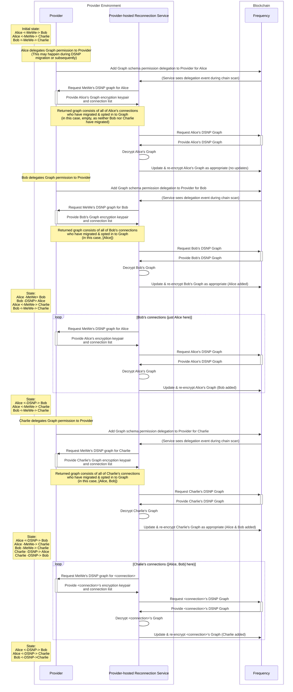

# Graph Reconnection Service
A microservice to reconnect graphs in DSNP/Frequency

## Overview/Design
The Graph Reconnection Service is designed to be hosted by a Provider inside their own environment. The service will scan the Frequency chain for new delegations to the Provider delegating Graph schema permissions for a user. The service then requests the user's Provider Graph and keys from the Provider, and updates the user's graph on-chain.

## Sequence Diagram

