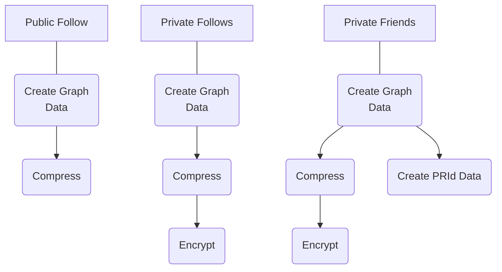

# Internal Service Graph Update Flows

The following diagram illustrates the differences in what is required to update a user's graph on-chain for different types of graphs: Public vs. Private, and Follow vs. Friendship. As shown, Private graph updates require the user's graph encryption keys, as Private graph data is stored encrypted on-chain. An additional requirement for Private Friendship also requires the counterparty's public graph encryption key. This enables the construction of a shared secret, a PRId, which is used to securely represent the connection in a public way. (The PRId is stored publicly on-chain, but the other side of the connection cannot be derived from it.)

